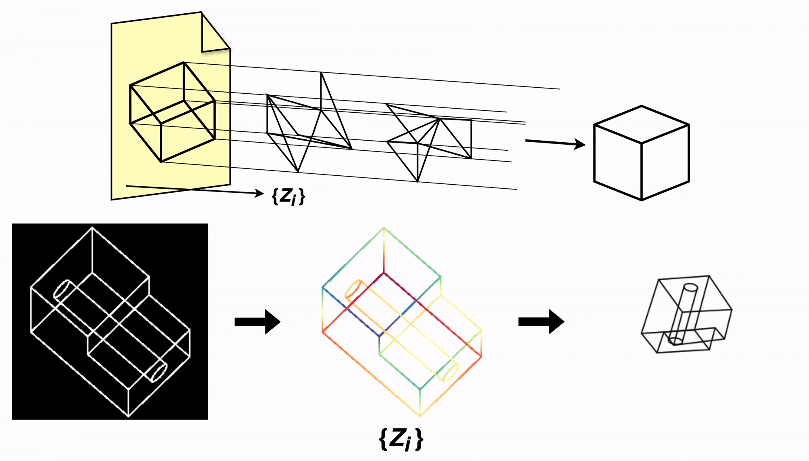

# Reconstruction of a 3D wireframe from a single line drawing via generative depth estimation

### [Project Page](https://eltonc01.github.io/sketch-depth-diffusion/) | [Paper](https://arxiv.org/abs/2604.13549) | [Weights](https://huggingface.co/eltoncao/sketch_depth/tree/main) | [Dataset](https://huggingface.co/datasets/eltoncao/wireframe-data/tree/main) | [Live Demo](https://sketch-recon.vercel.app/)

[Reconstruction of a 3D wireframe from a single line drawing via generative depth estimation](https://arxiv.org/abs/2604.13549)
[Elton Cao](https://www.linkedin.com/in/elton-cao/)<sup>1</sup>, [Hod Lipson](https://www.hodlipson.com/)<sup>1</sup><br>
<sup>1</sup>Creative Machines Lab, Columbia University



## Setup

Preferred: create the conda environment from [environment.yml](environment.yml), since OpenCascade (`pythonocc-core`) is conda-managed.

```bash
conda env create -f environment.yml
conda activate sketch_recon
```

Pip-only install is possible for most Python dependencies:

```bash
python -m pip install -r requirements.txt
```

But `dataset_tools` and benchmark rendering paths that import `OCC` still require:

```bash
conda install -c conda-forge pythonocc-core=7.9.0
```

## Models Weights and Dataset

- Dataset repo: `eltoncao/wireframe-data`
- Model repo: `eltoncao/sketch_depth`
- Checkpoint manifest used by runners: [sketch_recon/config/checkpoints.json](sketch_recon/config/checkpoints.json)

Auto-detection notes (minimal):

- Inference and benchmark resolve checkpoint paths from `--model_variant` via the manifest above.
- Benchmark also infers UNet architecture + conditioner settings directly from the loaded checkpoint.
- Training still uses explicit CLI knobs for architecture/training behavior (while `--model_variant` resolves shared VAE/stats paths).

Download weights & dataset:

- Model checkpoints (needed for inference/training):

```bash
python scripts/download_checkpoints.py --only models --model-variant dinov2_vast
```

- Dataset assets (only needed for benchmark/training, not the bundled inference demo):

```bash
python scripts/download_checkpoints.py --only dataset --dataset-name default --extract-dataset
```

## Inference Demo

Sample sketch masks included under [assets/demo_inputs](assets/demo_inputs), so you can run inference without generating/importing dataset assets first.

Run inference on bundled sketch PNGs:

```bash
python scripts/infer_demo.py \
  --model_variant dinov2_vast \
  --input_dir assets/demo_inputs \
  --output_dir demo_outputs/inference \
  --num_steps 20 \
  --cfg_scale 1.0
```

Outputs are written as:
- `<name>__pred_norm_disp.npz` (raw normalized disparity)
- `<name>__pred_norm_disp.png` (8-bit preview)

## Run Benchmark

```bash
python benchmark/run.py \
  --strict_clean \
  --noise_levels 0.0 \
  --completion_ratios 0.0 \
  --suite difficulty_occlusion \
  --model_variant dinov2_vast \
  --run_name paper_eval_dinov2_vast
```

This runs a strict-clean benchmark preset and resolves checkpoints via the shared checkpoint manifest.

Tip: switch `--model_variant` to evaluate a different published checkpoint set without editing paths manually.

## Training

```bash
python sketch_recon/training/train_diffusion.py \
  --data_mode clean \
  --use_controlnet \
  --control_encoder dinov2 \
  --batch_size 192 \
  --epochs 100 \
  --precision bf16-mixed \
  --model_variant dinov2_vast
```

## Acknowledgements

Many thanks to [FaceFormer](https://github.com/manycore-research/faceformer) for the CAD to wireframe infra.

This work was supported by the US National Science Foundation (NSF) AI Institute for Dynamical Systems ([DynamicsAI.org](https://DynamicsAI.org)) under grant 2112085.

## Citation

```bibtex
@misc{cao2026reconstruction3dwireframesingle,
  title={Reconstruction of a 3D wireframe from a single line drawing via generative depth estimation}, 
  author={Elton Cao and Hod Lipson},
  year={2026},
  eprint={2604.13549},
  archivePrefix={arXiv},
  primaryClass={cs.CV},
  url={https://arxiv.org/abs/2604.13549}, 
}
```
